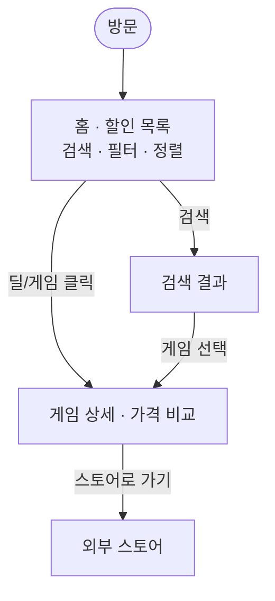

# 딜모아(DEALMOA) — 화면 설계 · Figma 브리프

> 확정 목업 기반. 화면 설계·구현의 단일 레퍼런스.
> **라이트 모드 · 데스크톱 1280 + 모바일 390 · Pretendard**
> 상위 개요는 [`game-deal-project-overview.md`](./game-deal-project-overview.md), 데이터/API는 [`game-deal-spec.md`](./game-deal-spec.md).

---

## 1. 디자인 시스템

### 컬러
| 용도 | 값 |
|------|-----|
| 브랜드 / 포인트 | `#7C5CE0` (보라), hover `#5B3EC8` |
| 배경 | `#F5F6F9` / `#EAEBEF` |
| 카드 | `#FFFFFF` (border `rgba(15,17,23,.08)`) |
| 텍스트(강) | `#14161F` |
| 텍스트(약) | `#4B5162` · `#6E7480` · `#8A8F9E` |
| 정가(취소선) | `#9AA0AE` |

### 할인율 티어 색상 (핵심 규칙)
할인율 구간에 따라 **할인가·할인율 뱃지 색이 바뀜**. `tier(percent)` 유틸로 구현:

| 할인율 | 색상 | 의미 |
|--------|------|------|
| 10–30% | `#15803D` 초록 | 약한 할인 |
| 31–50% | `#B45309` 앰버 | 중간 |
| 51–80% | `#7C3AED` 보라 | 강함 |
| 81–99% | `#DC2626` 빨강 | 매우 강함 |
| 100% | `#0284C7` 파랑 | 무료 |

### 타이포 (Pretendard)
- 로고 `900` / -0.03em, 뒤에 보라 `.` 액센트
- 섹션·가격 강조 `800` · 게임명 `700` · S3 게임 타이틀 `900` 32px

### 스토어 뱃지 (색상 + 이니셜)
| 스토어 | 이니셜 | 색 |
|--------|--------|-----|
| Steam | S | `#66C0F4` |
| Epic | E | `#C9CEDB` |
| GOG | G | `#C084FC` |
| Humble | H | `#FF6B6B` |
| Fanatical | F | `#FB923C` |

---

## 2. 유저 플로우

- 홈에서 **검색** → 검색 결과 → 게임 선택 → 상세
- 홈 목록에서 **딜 클릭** → 상세 직행
- 두 경로 모두 **상세(가격 비교)**로 수렴 → 스토어로 이동(외부)

---

## 3. 화면 목록

| # | 화면 | 뷰포트 | API |
|---|------|--------|-----|
| S1 | 홈 · 할인 목록 | 데스크톱 + 모바일 | `GET /api/deals`, `GET /api/stores` |
| S2 | 검색 결과 | 데스크톱 + 모바일 | `GET /api/games/search` |
| S3 | 게임 상세 · 가격 비교 | 데스크톱 + 모바일 | `GET /api/games/{gameId}` |

---

## 4. 화면별 상세

### S1. 홈 · 할인 목록
- **헤더**: 로고 · 검색바("게임 제목으로 검색") · 테마 토글
- **필터/정렬 바**: 스토어 칩(전체·Steam·Epic·GOG·Humble) · 가격 범위 슬라이더(핸들 2개) · 정렬 드롭다운("할인율 높은 순")
- **딜 카드 그리드**: 데스크톱 4열 / 모바일 1열 리스트
  - 카드: 커버아트(16:9) · 게임명 · 스토어(뱃지+이름) · ~~정가~~ · **할인가(티어색)** · 할인율 뱃지(티어색)
- **페이지네이션**: 1 2 3 … 12
- **푸터**: "가격은 각 스토어 기준이며 실시간과 다를 수 있습니다" · "데이터 출처 · 문의"

### S2. 검색 결과
- **헤더**: 검색바에 검색어 활성(보라 테두리)
- **결과 헤더**: "'batman' 검색 결과" · 건수 · 정렬("관련도순")
- **게임 카드**: 데스크톱 3열 / 모바일 리스트
  - 카드: 커버아트 · 게임명 · **"최저 $X~"(초록)** · 판매 스토어 뱃지들
- **빈 결과 힌트**: "찾는 게임이 없나요? 게임 제목의 영문 표기로 다시 검색해 보세요."

### S3. 게임 상세 · 가격 비교 (핵심)
- **헤더**: 로고 + 검색 (모바일은 뒤로가기 ←)
- **Breadcrumb**(데스크톱): 홈 / 검색: X / 게임명
- **키아트/배너**(16:9)
- **게임 정보**: 타이틀 · 메타크리틱 뱃지 · 스팀 평가("매우 긍정적 86%") · 퍼블리셔·연도·장르(향후) · 역대 최저가(파랑, 향후)
- **"스토어별 가격"** ("N개 스토어 · N분 전 갱신")
- **스토어 가격 행**(최저가 하이라이트): 스토어 뱃지+이름 · `최저가` 태그(보라) · ~~정가~~ · 할인가(티어색) · 할인율 뱃지 · **"스토어로 가기 ↗" 버튼**(보라)

---

## 5. 컴포넌트 인벤토리

- `Header` (로고 · 검색바 · 테마토글 / 모바일 뒤로가기)
- `SearchBar` (기본 / 활성-검색어 상태)
- `StoreFilterChips` (활성·비활성 칩)
- `PriceRangeSlider` (핸들 2개)
- `SortDropdown`
- `DealCard` (S1 그리드 카드)
- `GameCard` (S2 검색 카드 — 최저가 요약형)
- `StorePriceRow` (S3 가격 행 — 최저가 하이라이트 변형)
- `DiscountBadge` (**티어 색상 로직 적용**)
- `StoreBadge` (스토어별 색+이니셜)
- `Pagination` · `Breadcrumb`(S3) · `Footer` · `ThemeToggle`

---

## 6. 화면 ↔ API / 데이터 매핑

| 화면 | API | 주요 필드 |
|------|-----|-----------|
| S1 | `GET /api/deals` | thumbUrl, title, storeName(+뱃지), normalPrice, salePrice, savings(→티어색), currency |
| S1 필터 | `GET /api/stores` | 스토어 칩 목록 |
| S2 | `GET /api/games/search` | 게임 썸네일, title, 최저가, 판매 스토어 목록 |
| S3 | `GET /api/games/{gameId}` | 게임 메타 + deals[] (스토어별 가격, best 플래그) |

---

## 7. 설계 ↔ 백엔드 갭 (MVP 결정)

목업이 현재 스키마보다 앞서 나간 부분. 화면 설계는 그대로 가되 아래는 MVP에서 유의:

1. **퍼블리셔·연도·장르** (S3) — 현재 `games` 테이블엔 없음(CheapShark 미제공). Steam `appdetails` 연동 선행 필요 → **MVP는 생략**, 향후 보강.
2. **역대 최저가** (S3) — `price_history` 테이블은 **향후**. MVP는 표시 생략.
3. **USD/KRW 통화 전환** — D2대로 **환율 변환 금지**(실제 결제가와 어긋남). MVP는 **USD만**. KRW는 Steam `cc=kr` 실가격으로 향후.
4. **검색 "관련도순"** — MVP는 제목 `LIKE` 부분일치. 관련도 랭킹은 추후.
5. **"N분 전 갱신" 표시** — `deals.updated_at` 기준.

---

## 8. 다음 단계

- 이 문서 + 목업으로 **컴포넌트(5번)부터** 정의 → 화면(S1→S2→S3) 조립.
- 백엔드 API(`/api/deals` → `/api/games/{id}` → `/api/games/search` → `/api/stores`)에 순서대로 연결.
