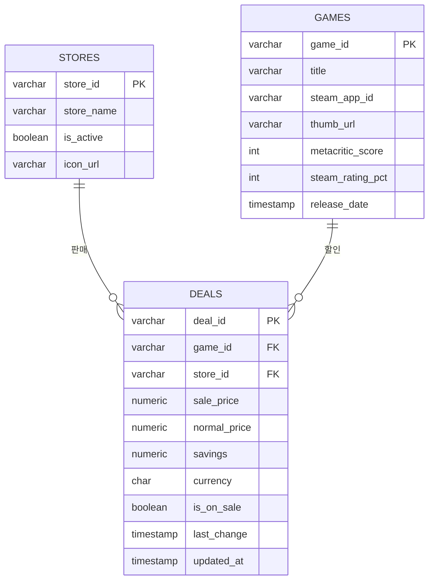

# 딜모아(DEALMOA) — 요구사항 · ERD · API 명세

> MVP 설계 문서. 데이터 소스는 **CheapShark**(뼈대) + **Steam / Epic / GOG / itch.io**(직접 연동, 향후).
> 스택: Spring Boot 3.5 + MyBatis + PostgreSQL 17 + React(Vite). 무료 티어 운영 목표.
> 상위 개요는 [`game-deal-project-overview.md`](./game-deal-project-overview.md), 화면은 [`figma-design-brief.md`](./figma-design-brief.md).

---

## 1. 요구사항 명세서

### 1.1 기능 요구사항

| ID | 기능 | 설명 | 우선순위 |
|----|------|------|----------|
| FR-01 | 통합 할인 목록 | 여러 스토어의 할인 게임을 한 화면에서 조회 | 필수 |
| FR-02 | 정렬 | 할인율 높은 순 / 가격 낮은 순 | 필수 |
| FR-03 | 스토어 필터 | 특정 스토어의 딜만 필터링 | 필수 |
| FR-04 | 가격대 필터 | 최소~최대 가격 범위 필터 | 권장 |
| FR-05 | 게임 검색 | 게임 제목으로 검색 | 필수 |
| FR-06 | 스토어별 가격 비교 | 같은 게임의 스토어별 가격을 나란히 비교 | 필수 |
| FR-07 | 자동 수집 | 주기적으로 외부 소스에서 수집 (`@Scheduled`, 기본 6시간) | 필수 |
| FR-08 | 역대 최저가 | 게임별 역대 최저가 (CheapShark `/games`) | 향후 |
| FR-09 | 통화 표시 | USD / KRW 전환 | 향후 |

### 1.2 비기능 요구사항

| ID | 항목 | 내용 |
|----|------|------|
| NFR-01 | 비용 | 무료 티어로 운영 (호스팅·DB 0원 목표) |
| NFR-02 | 성능 | 사용자 요청은 DB 캐시에서만 응답, 외부 API 직접 호출 없음 |
| NFR-03 | Rate limit | 외부 호출은 수집 주기에만 발생 |
| NFR-04 | 장애 격리 | 스토어 하나가 죽어도 나머지 수집·서비스 무중단 (Fetcher 분리) |
| NFR-05 | 국제화 | 한글 게임명 정상 표시 (DB UTF8) |
| NFR-06 | 데이터 신선도 | 할인 정보 최소 하루 수 회 갱신 (기본 6시간 = 하루 4회) |

---

## 2. ERD



**관계**
- `stores` 1 : N `deals` — 한 스토어에 여러 딜
- `games` 1 : N `deals` — 한 게임이 여러 스토어에서 할인

**설계 포인트**
- `deals`는 `games` × `stores`를 잇는 교차 엔티티. "게임 × 스토어 × 가격 = 딜 한 건".
- 같은 게임이 여러 스토어에 있으면 `game_id`가 같은 여러 `deals` 행 → 가격 비교의 근거.
- `currency`는 지금 전부 `'USD'`. 향후 Steam `cc=kr` 연동 시 같은 테이블에 `'KRW'` 행 추가(마이그레이션 불필요).
- 외부 응답의 문자열 가격(`"7.49"`)·epoch 시간(`1687058152`)은 수집 단계에서 `NUMERIC`·`TIMESTAMP`으로 변환 후 저장.
- `deals.updated_at`은 INSERT 시 기본값, UPDATE 시 트리거(`deals_set_updated_at`)로 자동 갱신 → "N분 전 갱신" 표시 근거.

---

## 3. API 명세서

- **Base URL**: `/api` · **응답**: JSON · **인증**: 없음(공개 조회)
- **금액 표기**: `price`(숫자) + `currency`(통화 코드) 쌍

### 3.0 엔드포인트 요약

| Method | Path | 설명 |
|--------|------|------|
| GET | `/api/deals` | 할인 목록 (정렬·필터·페이징) |
| GET | `/api/deals/{dealId}` | 딜 상세 |
| GET | `/api/games/{gameId}` | 게임 상세 + 스토어별 가격 비교 |
| GET | `/api/games/search` | 게임 제목 검색 |
| GET | `/api/stores` | 활성 스토어 목록 |

### 3.1 GET /api/deals

메인 화면용 할인 목록.

| 파라미터 | 타입 | 필수 | 기본값 | 설명 |
|----------|------|------|--------|------|
| `sort` | string | N | `savings` | `savings`(할인율↓) / `price`(가격↑) |
| `storeId` | string | N | - | 스토어 필터 |
| `minPrice` | number | N | - | 최소 가격 |
| `maxPrice` | number | N | - | 최대 가격 |
| `page` | int | N | 0 | 페이지 번호 (0-base) |
| `size` | int | N | 20 | 페이지 크기 |

**Response 200**

```json
{
  "content": [
    {
      "dealId": "X8sebHhbc1Ga0dTkgg59WgyM506af9oNZZUC5l8twmU=",
      "title": "Batman: Arkham City - GOTY",
      "gameId": "167613",
      "storeId": "1",
      "storeName": "Steam",
      "salePrice": 7.49,
      "normalPrice": 19.99,
      "savings": 62.53,
      "currency": "USD",
      "thumbUrl": "https://..."
    }
  ],
  "page": 0,
  "size": 20,
  "totalElements": 1342,
  "totalPages": 68
}
```

### 3.2 GET /api/deals/{dealId}

딜 단건 상세.

```json
{
  "dealId": "X8seb...twmU=",
  "gameId": "167613",
  "title": "Batman: Arkham City - GOTY",
  "storeId": "1",
  "storeName": "Steam",
  "salePrice": 7.49,
  "normalPrice": 19.99,
  "savings": 62.53,
  "currency": "USD",
  "isOnSale": true,
  "lastChange": "2023-06-18T02:35:52"
}
```

### 3.3 GET /api/games/{gameId}

게임 상세 + 스토어별 가격 비교 (FR-06).

```json
{
  "gameId": "167613",
  "title": "Batman: Arkham City - GOTY",
  "steamAppId": "200260",
  "metacriticScore": 91,
  "steamRatingPercent": 97,
  "thumbUrl": "https://...",
  "deals": [
    { "storeId": "1",  "storeName": "Steam", "salePrice": 7.49, "normalPrice": 19.99, "savings": 62.53, "currency": "USD" },
    { "storeId": "25", "storeName": "Epic",  "salePrice": 8.99, "normalPrice": 19.99, "savings": 55.02, "currency": "USD" }
  ]
}
```

### 3.4 GET /api/games/search

| 파라미터 | 타입 | 필수 | 기본값 | 설명 |
|----------|------|------|--------|------|
| `q` | string | Y | - | 검색어 (게임 제목, 부분 일치) |
| `page` | int | N | 0 | 페이지 번호 |
| `size` | int | N | 20 | 페이지 크기 |

**Response 200**: 게임 단위 목록(각 게임의 최저가 요약 포함), `3.1`과 유사한 페이징 구조.

### 3.5 GET /api/stores

활성 스토어 목록 (프론트 필터 UI 구성용).

```json
[
  { "storeId": "1",  "storeName": "Steam", "iconUrl": "https://www.cheapshark.com/img/stores/icons/0.png" },
  { "storeId": "25", "storeName": "Epic Games Store", "iconUrl": "https://..." }
]
```

### 3.6 공통 에러 응답

```json
{ "timestamp": "2026-07-06T09:12:00", "status": 404, "error": "Not Found", "message": "deal not found: {id}" }
```

| 상태 코드 | 상황 |
|-----------|------|
| 400 | 잘못된 파라미터 (예: `size`가 음수) |
| 404 | 존재하지 않는 리소스 (dealId / gameId) |
| 500 | 서버 내부 오류 |

---

## 4. 향후 확장 (MVP 이후)

- **가격 이력 테이블** — CheapShark `/games`의 `cheapestPriceEver`로 "역대 최저가"(FR-08). `price_history(game_id, store_id, price, recorded_at)`.
- **KRW 지원** — Steam `appdetails?cc=kr`로 실제 원화 정가 수집, `currency='KRW'` 행 추가(FR-09).
- **직접 연동 확대** — Epic(GraphQL) / GOG / itch.io Fetcher 구현체 추가.
- **관리자 수동 수집 트리거** — `POST /api/admin/refresh`(인증 필요).
